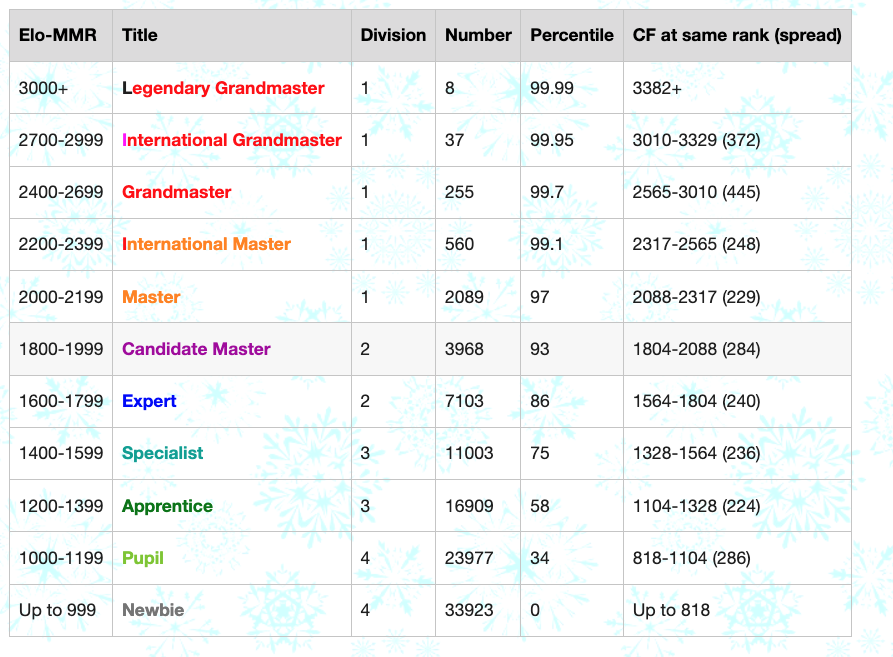

# Competitive Programming - 2025 - Codeforces - Newbie to Specialist

## Goal

To become a specialist in Codeforces by 2025.

## Approach

- Get better at data structures and algorithms.
- Review Math concepts required for Competitive Programming.
- Solve about 100 problems in each level of Codeforces between 800 and 1600
- Solve about 25 problems per level between 1600 and 2000
- Solve about 10 problems per level between 2000 and 2200

- [ ] Review on 1st April 2025