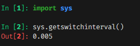

## Notes

**Thread**: Also called light weight processes. They have shared execution context. Which means they share memory space and hence are easier to spawn. Unlike process, which needs its own virtual address space. Also, file descriptors are shared between threads.

In python, thread-based concurrency is limited by Global Interpreter Lock(GIL). Threads are only allowed to be executed in parallel when GIL is released. Otherwise, they execute concurrently.

Note: Concurrency does not mean parallelism. In concurrency , process/thread is pre-empted after its allocated time slice of the CPU and then scheduled again based on the scheduler policy.

**Question**: Why GIL is an issue for threading?

**Answer**: Any thread that is spawned in the python process needs to acquire GIL(just like acquiring a mutex lock) before running the thread. So, for a single threaded program, main thread always holds the GIL. But, when we spawn multiple threads they need to acquire GIL and only then they are allowed to execute.

In Cpython , when a thread acquires a lock, it is released for the following reasons
1. When executing bytecode, it is released after executing certain number of bytecode instructions. 
    a. This can be modified by using `sys.setswitchinterval()`
    b. You can find the exact interval using `sys.getswitchinterval()`

      

2. When performing I/O operation, lock is automatically released. Once the thread complets its I/O operation, it will be moved into ready state and is eligible to be scheduled by the scheduler. You can find more info on this by looking into the CPython source code. Look for `Py_BEGIN_ALLOW_THREADS` in [bufferedio.c](https://github.com/python/cpython/blob/b8d1744e7ba87a4057350fdfd788b5621095fc59/Modules/_io/bufferedio.c)

Note: When you create new lock objects to synchronize in the code, you will be responsible to release these locks.

Note-2: If you are writing a C library to be imported in python. Then, you need to take care of acquiring and releasing the GIL. Else, code keeps executing till holding the GIL till its completes the C library call.

**Question**: Is GIL required?
**Answer**: Yes, Cpython interpreter isn't thread safe. Hence, will cause race conditions.

**Question**: When to use threads?
**Answer**: Best if you have lot of I/O tasks. Also, consider when calling methods in few packages like numpy where they release GIL in their C code.

**Question**: When not to use threads:
**Answer**: When you have CPU intensive tasks

#### threading module in Python

`threading` internally depends on `_thread` which is written in `C`. Along with this, there is another module named `_threading_local` which seems to be used for managing local data of a thread.

Link to modules:
1. [_thread](https://github.com/python/cpython/blob/a8a89fcd1ff03bb2f10126e0973faa74871874c3/Modules/_threadmodule.c) 
2. [threading.py](https://github.com/python/cpython/blob/f5198b09e16bca1886f8245fa88203d07d51ec11/Lib/threading.py)
3. [_threading_local.py](https://github.com/python/cpython/blob/2085bd0877e17ad4d98a4586d5eabb6faecbb190/Lib/_threading_local.py)

